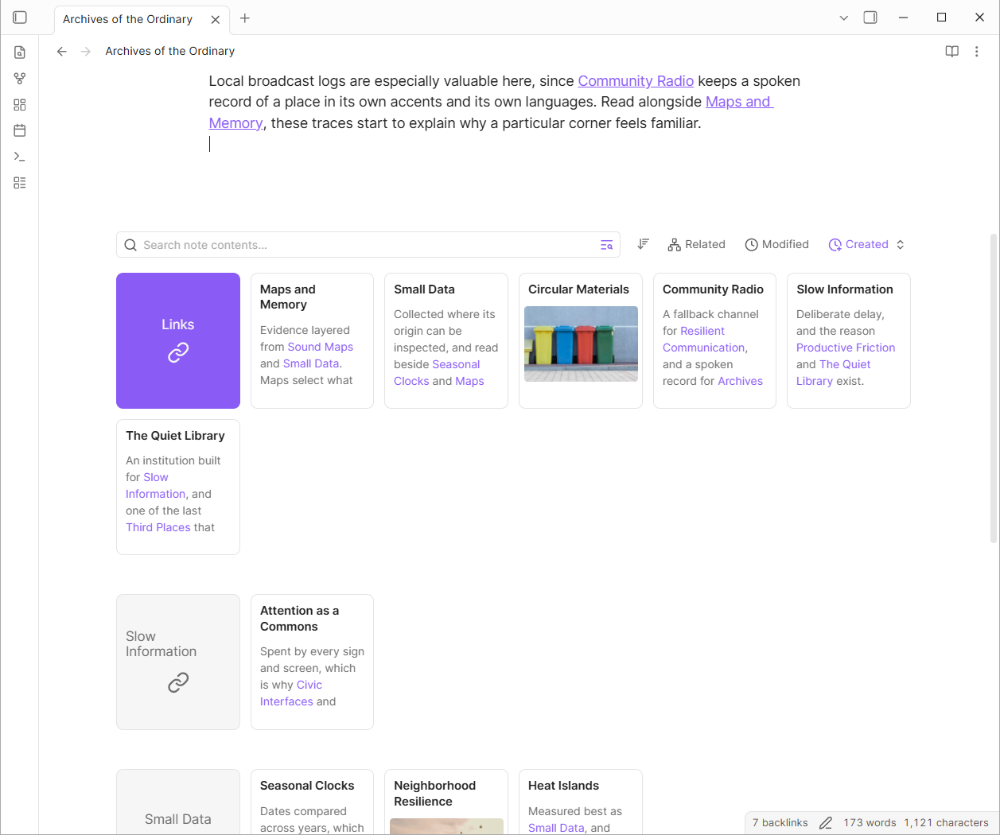
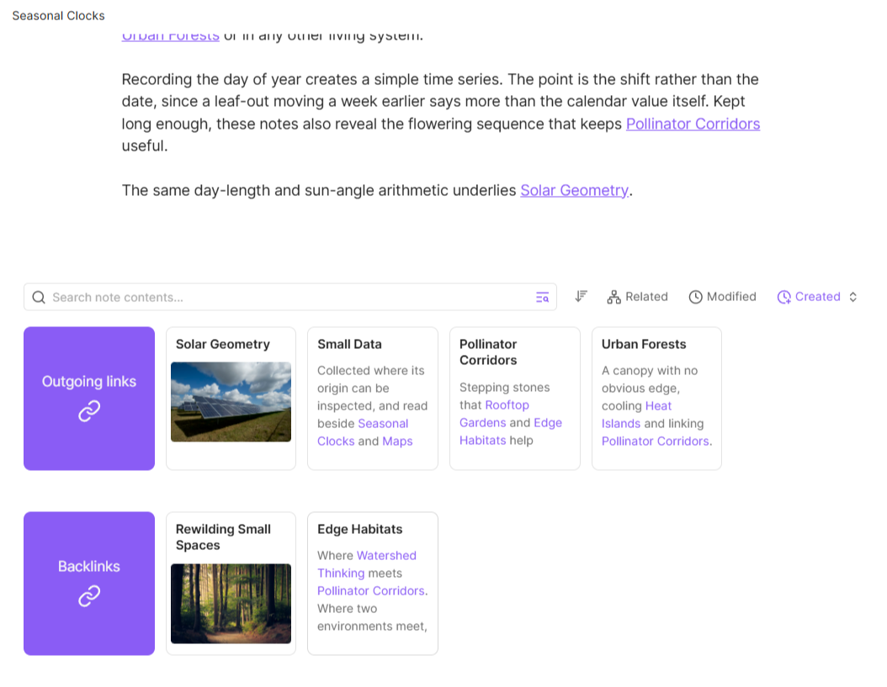
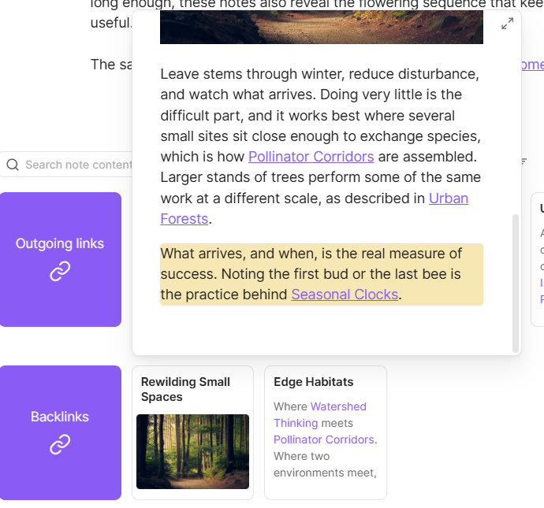
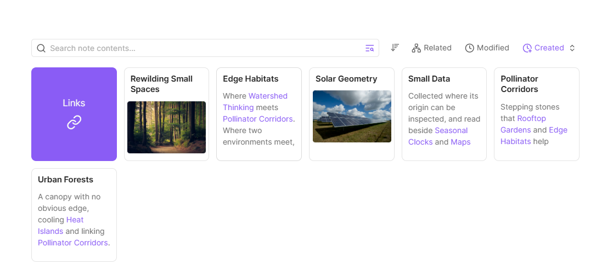
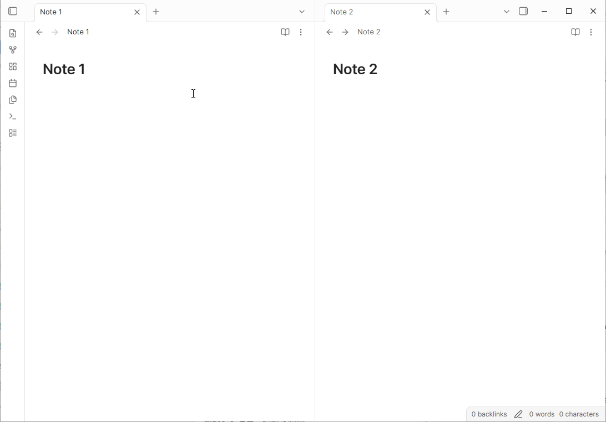
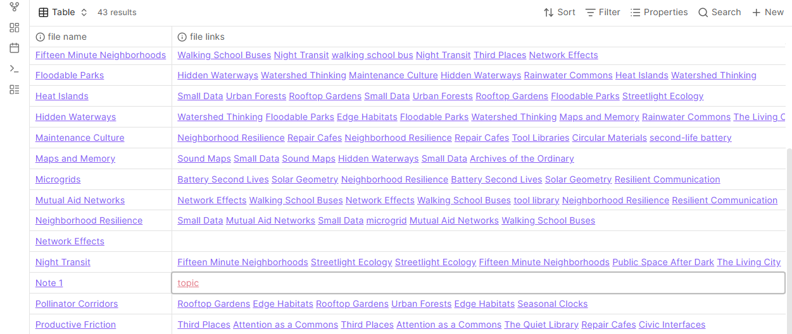
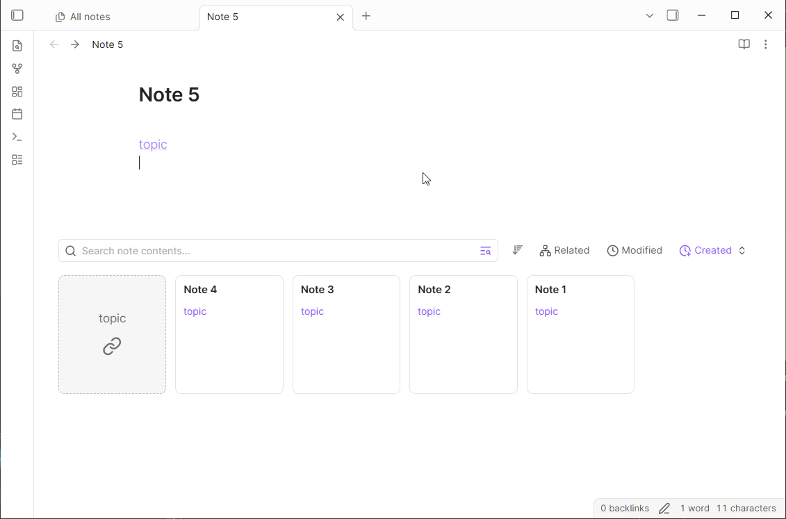
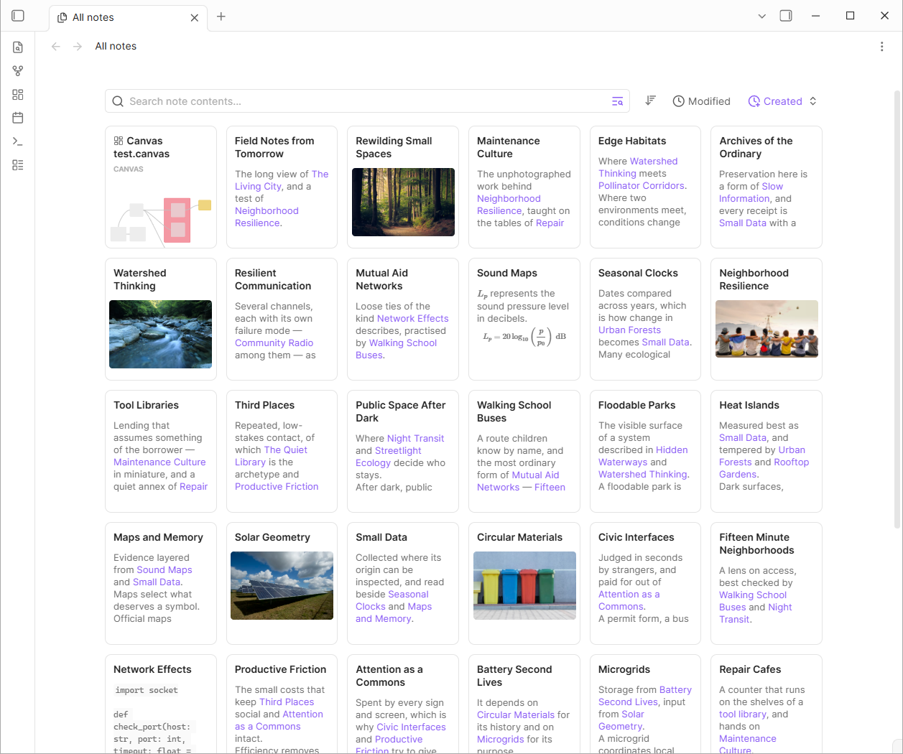
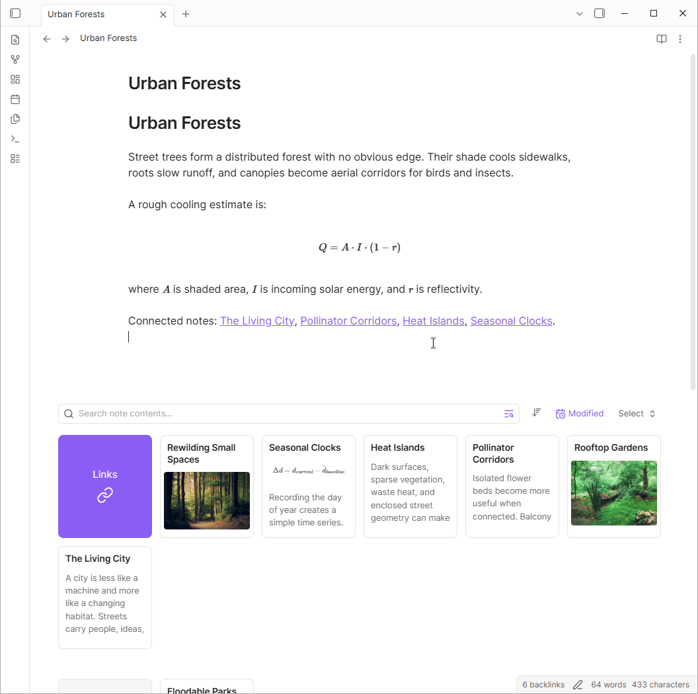

# Cosense-style Card Links

最大 2 ホップ先までの関連リンクを [Cosense](https://scrapbox.io) 風のカード形式で表示する Obsidian プラグインです。

カード内にはノート内容のプレビュー（テキスト、数式、コードブロック、画像、動画/YouTube/Canvasのサムネイルなど）が生成されます。




※ 数万ファイル規模の保管庫では、起動直後のインデックス作成に数秒程度の時間がかかります。インデックス作成後は軽量な差分更新でインデックスを更新するため、ノートの編集の妨げになることはありません。

## 機能

### Backlink と Outgoing Link をカードで表示



ノートのBacklinkとOutgoing linkをカード形式で表示します。



カード上でCtrl + マウスオーバーで page preview が表示されます。リンク先の情報がある場合はその場所をハイライトします。



BacklinkとOutgoing linkを統合して一つのセクションに表示することもできます。

### 2 ホップ先のリンクをカードで表示



現在のノートと共通の Outgoing linkを持つ別のノートがある場合、そのリンクを介して関連ノートがカード形式で相互に表示されます。

**このとき、このリンク先のノート自体がまだ作成されていなくても、ノート同士は接続されます。**

なお、そのノートでしか参照されていないリンクはエディタ上では赤色で表示され、「New links」 としてカードで表示されます。
参照されているノート数が2つ以上の場合、 Obsidian デフォルトの色で表示されます。



baseやcanvas上でもエディタ内と同様にリンクの色が変化します。

### 未解決リンクの被リンクを表示



Obsidian では、未解決リンクを「作成せず開く」ことができません。このプラグインでは、未解決リンクを「まだ実体はないが概念としては存在するノート」として開き、それを参照するノートをカード形式で表示します。これにより、不要なファイルを増やさずにリンク関係を閲覧でき、必要なときだけ実体化できます。

ノートを作成したい場合は、開いた直後にEnterキーを押すか、「Create file」ボタンを押すことでノートを作成できます。

また、Obsidian では、未解決リンクを未解決のまま一括でリネームすることができませんが、このビューからは、ファイルを作成せずに一括でリネームすることができます。

### すべてのノートをカードで表示

新しいタブにすべてのノートがカード形式で表示されます。



### カードの検索・フィルタリング



表示されたカードのタイトルとコンテンツを検索・フィルタリングできます。マッチしたカードのみが表示され、マッチしたワードはハイライトされます。

検索バー横のボタンをクリックして、検索対象を タイトルのみ/全文検索 のいずれかに切り替えることができます。

### その他の機能

- **表示モード**: サイドバー、エディター下部への表示、または両方を組み合わせたレイアウトから選べます。
	- pdf, base, canvas, その他の添付ファイルのbacklinkを表示するには、`Sidebar` もしくは `Hybrid` を選択してください。
- **タグビュー**: 任意のタグをクリックすると、該当するノートをカードグリッドで表示できます。
	- **注意:** 実装の都合上、obsidianのコアプラグインの `core search` プラグインを有効化しないとタグをクリックでカードグリッドが表示されません。
- **Obsidian CLI 連携 (実験的)** — 1 ホップ／2 ホップのコンテキストを含むページの確認、近傍のノートの検索、関連カードの表示、安全なリンク先置換の機能があります。(標準的なファイル操作と検索には、Obsidian 組み込みの CLI を使用してください。)
	- [Cosense-style Card Links エージェントスキル](skills/cosense-style-card-links/SKILL.md)をインストールするには、`skills/cosense-style-card-links/` をエージェントのスキルディレクトリへコピーしてください。
- **[obsidian-advanced-canvas](https://github.com/Developer-Mike/obsidian-advanced-canvas) との統合 (実験的)**: advanced canvasプラグインとの併用で、canvasのリンクがサイドバーで閲覧できるようになります。

## インストール

本プラグインは Obsidian Community Plugins への登録を行っていません。

[BRAT](https://github.com/TfTHacker/obsidian42-brat) を導入し、`https://github.com/uoFishbox/obsidian-cosense-style-card-links`  を追加してインストールしてください。

## 開発

```bash
bun install
bun run dev
```

## 免責事項

本プラグインは個人が開発した非公式プロジェクトであり、株式会社HelpfeelおよびHelpfeel Cosenseとは一切関係ありません。

## ライセンス

MIT
